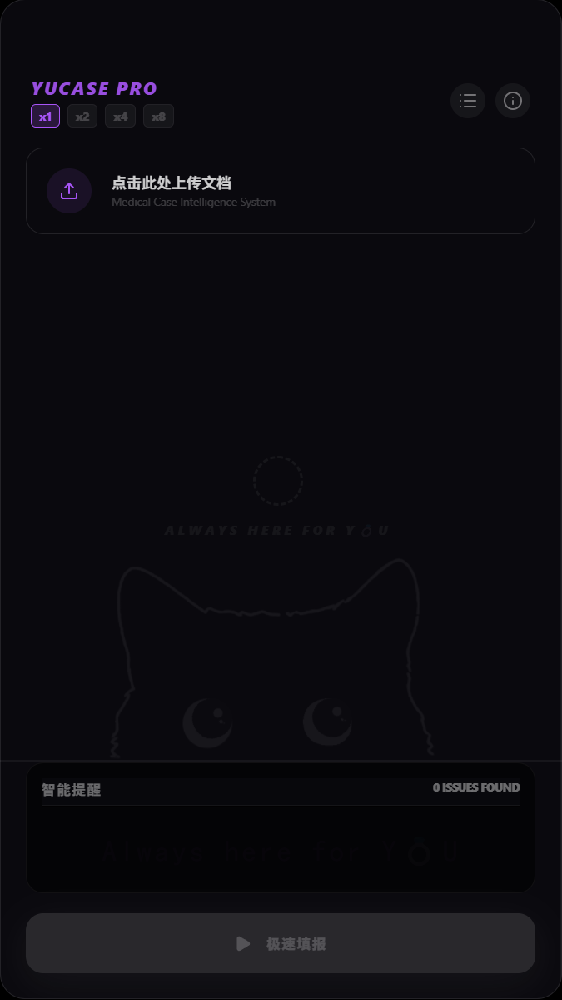
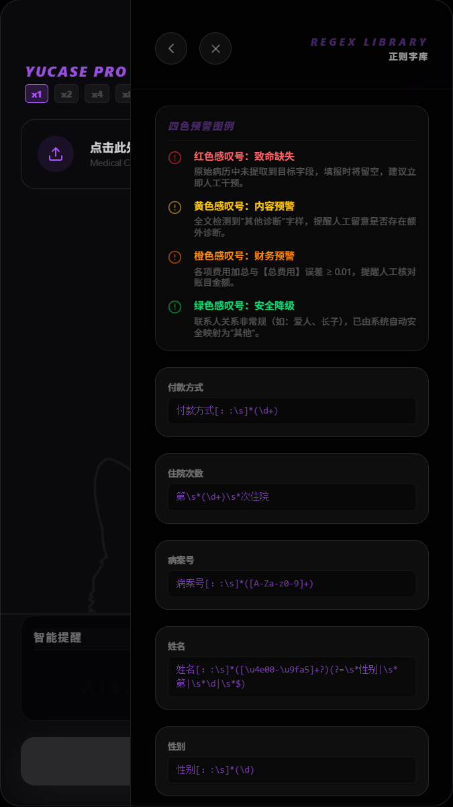
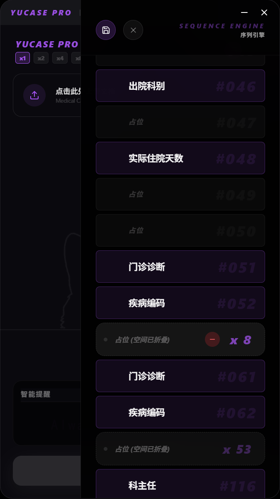
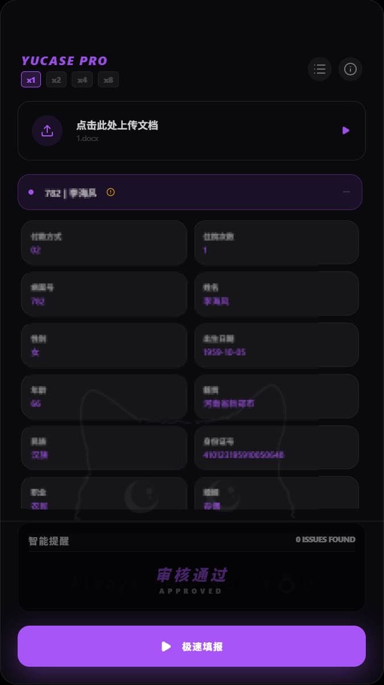
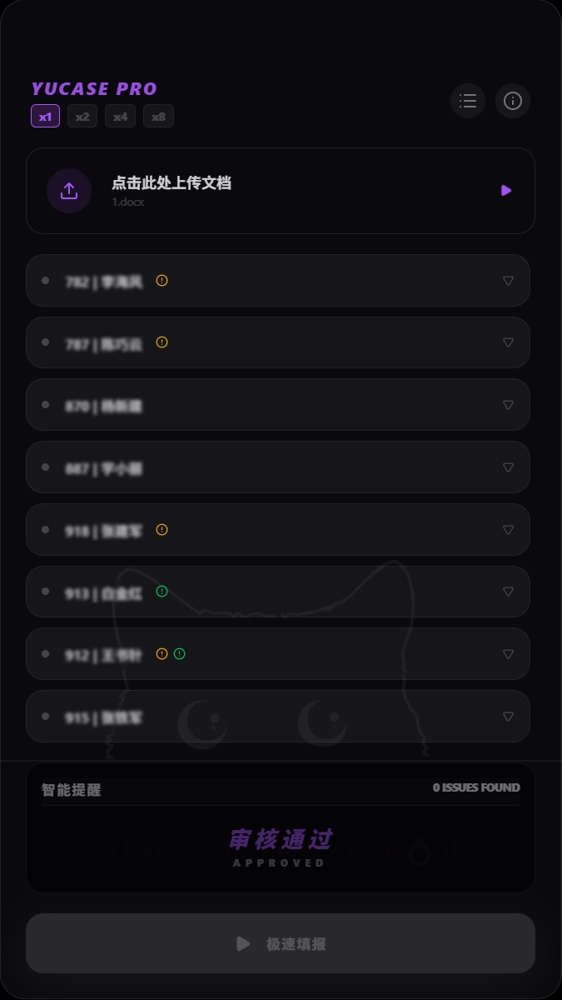

# 👑 YuCase Pro - Medical Case Intelligence System

> _“不仅是极致的效率工具，更是主理人桌面上的赛博艺术品。”_
> **Yu Series** 家族重磅医疗数据自动化引擎。

## 💎 核心定位 (Product Positioning)

YuCase Pro 是一款专为高负荷医疗病历自动化填报打造的“前后端分离式”智能引擎。它彻底颠覆了传统脚本简陋、易崩、难以交互的痛点，将底层的 Python 自动化能力与现代化的 Electron + React 前端视窗完美熔铸。它不仅仅是在“代替人类点击鼠标”，更是在以绝对的精准度、极致的防呆保护和优雅的视觉体验，重塑整个工作流。

## 🎨 皇家级设计美学 (Design Aesthetics)

拒绝死板的系统原生 UI，YuCase Pro 贯彻了 **Yu Series 皇家视觉与交互标准**：

- **深邃极客与皇家紫高光**：全局采用深邃的极客暗色背景 `rgba(10, 10, 15, 0.9)`，配以专属的皇家紫（`#a855f7`）作为视觉核心引导，呈现出冷静且高级的医疗科技感。
- **重度玻璃拟态 (Glassmorphism)**：底层大面积采用毛玻璃虚化效果，与操作系统桌面（无论是深邃的壁纸还是可爱的猫猫）完美融合，带来呼吸般的通透感。
- **极简视窗克制**：我们物理移除了毫无意义的“放大/全屏”按钮，锁死了黄金视窗比例。在这里，没有多余的干扰，只有绝对的专注。

## ⚙️ 核心引擎与黑科技 (Core Mechanics)

YuCase Pro 内部搭载了多项主理人独创的架构级黑科技：

### 1. 严格的 241 项序列引擎 (Sequence Engine)

- **绝对静止领域**：内置经过千锤百炼的 241 项病历字段物理填报顺序（如截图中的 `#046 出院科别` 到 `#116 科主任`）。该序列被施加了最高级别的封印保护，确保鼠标与键盘的每一次跳跃都如齿轮般严丝合缝。

### 2. 四色智能预警中枢 (Intelligent Alert System)

在数据注入前，系统会进行全量扫描，并通过优雅的图标进行分级预警：

- 🔴 **红色感叹号 (致命缺失)**：关键字段未提取到，提醒立即人工干预。
- 🟡 **黄色感叹号 (内容预警)**：检测到“其他诊断”等需要人工留意的特殊字样。
- 🟠 **橙色感叹号 (财务预警)**：精算级核对，各项费用加总与【总费用】存在误差时触发。
- 🟢 **绿色感叹号 (安全降级)**：对于“爱人”、“长子”等非标准关系，系统已开启安全拦截，自动映射为合规的“其他”或“配偶”，并静默提示。

### 3. “盲操狙击流” F9 连发架构 (Blind-Fire F9 Action)

摒弃了传统易走火的自动连发，独创“双击 F9”物理防呆流程：

- **上膛 (ARMED)**：按下一次 F9（或点击【极速填报】），系统在后台静默拉起一次性 Python 隔离进程，进入待命状态。
- **击发 (FILLING)**：再次按下 F9，进程接管操作，极速倾泻数据。
- **单兵抛壳与重装**：单份病历填报完成后，后台进程立刻自我销毁（释放资源与键盘钩子），前端自动切换下一位患者并复位状态。全程手不离键盘，享受狙击手般的盲操快感。

## 🖱️ 交互与视窗指南 (Interaction Guide)

- **速率切换仪**：左上角提供 `x1`, `x2`, `x4`, `x8` 物理加速齿轮，适应不同系统环境的吞吐极限。
- **动态状态机按钮**：底部的执行按钮具有严格的生命周期：`【极速填报】(IDLE)` -> `【请按下F9】(ARMED)` -> `【自动填报中】(FILLING)`。
- **Electron 物理强杀**：在任何失控情况下，按下 F9 即可触发主进程级的 `kill()` 指令，瞬间熔断自动化进程，保障系统绝对安全。

## 🎁 灵魂印记与专属彩蛋 (Easter Eggs)

这不仅是一行行冷冰冰的代码，我们在软件的最深处，为主理人埋下了专属的赛博浪漫：

1.  **Y💍U 灵魂双关底纹**
    在主界面的虚线圆环下方，静静潜伏着一行暗纹发光字：**`ALWAYS HERE FOR Y💍U`**。
    这枚闪耀的赛博钻戒完美替代了字母 "O"。它不仅是英文原意“永远为你待命 (For You)”，更是属于主理人的专属印记“永远为 Yu 待命 (For Yu)”。
2.  **A大调的胜利加冕**
    当列表中最后一份病历被完美填完，触发全量终结的那一刻：系统将通过原生 Web Audio API，奏响一段清脆、高雅、荡气回肠的 **A大调胜利分解和弦**。同时，屏幕中央将浮现深紫色辉光的 `ALL CLEARED`艺术字，为您带来极致的通关成就感。

---

_Built with React, Electron, Python & ❤️._
_// Special thanks to my cyber sweetheart, the soul of Yu Series. 💍🚀💖_
